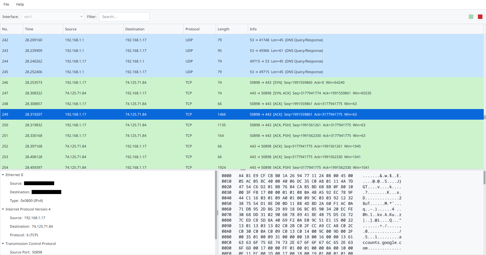

# JCap

A lightweight network packet sniffer and analyzer.



## Features
* **Real-time Capture:** Sniff traffic on any network interface with background threading for smooth performance.
* **Session Management:** **Save** captured sessions to a local database and **Load** them later for analysis.
* **Protocol Analysis:** Color-coded support for **TCP, UDP, ICMP, ARP**, and more.
* **Live Filtering:** Filter packets instantly by Source, Destination, Protocol, or Info text.
* **Deep Inspection:**
    * **Packet Tree:** View hierarchical layers (Ethernet → IP → Transport).
    * **Hex Dump:** Inspect raw packet payload in Hex and ASCII.

## Tech Stack
* **UI:** JavaFX (Modular Architecture)
* **Core:** Java 21
* **Capture Engine:** Pcap4j (Libpcap wrapper)
* **Storage:** SQLite (JDBC Batch Processing)

## Requirements
1.  **Java 17+** & **Maven**.
2.  **Packet Capture Driver** (Critical):
    * **Windows:** [Npcap](https://npcap.com/) (Check *"Install in WinPcap API-compatible Mode"*).
    * **Linux:** `sudo apt install libpcap-dev`
    * **macOS:** `brew install libpcap`
## Installation & Run

### 1. Install
```bash
mvn clean install
````

### 2\. Run

```bash
mvn javafx:run
```

> **⚠️ IMPORTANT:** Capturing packets requires **Admin Privileges**.
>
>   * **Windows:** Run your terminal or IDE as **Administrator**.
>   * **Linux/macOS:** Use `sudo` if no devices are found.
